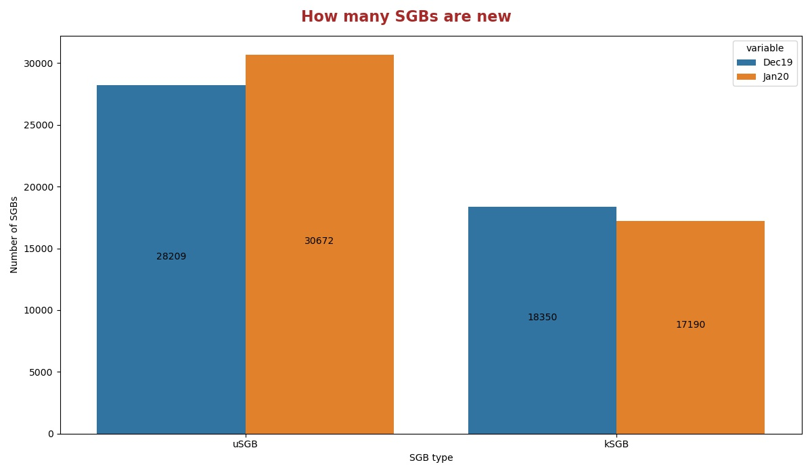
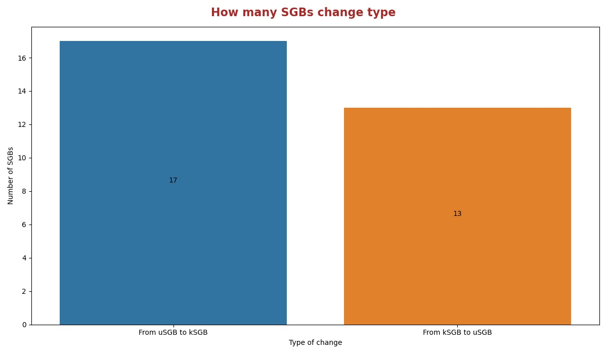
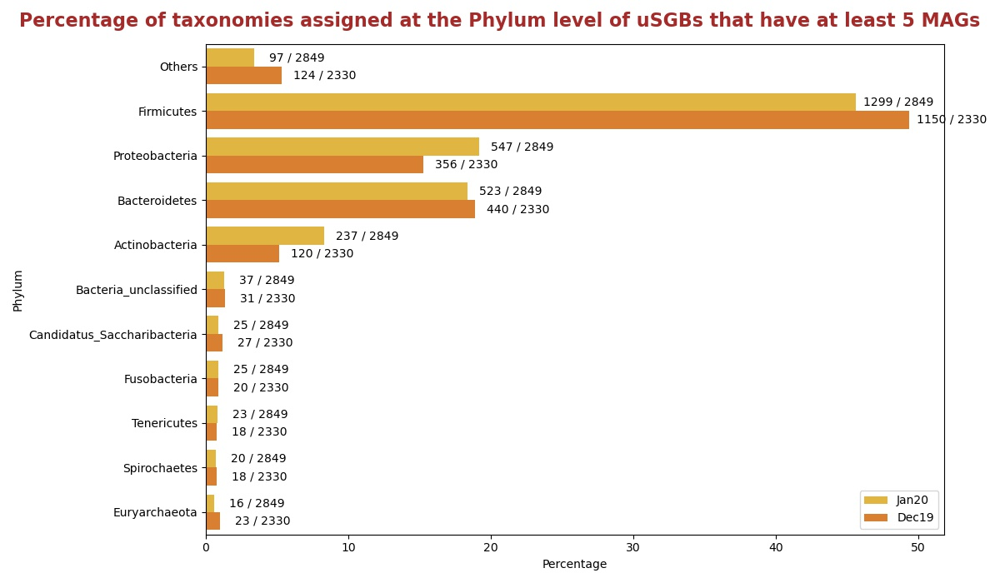
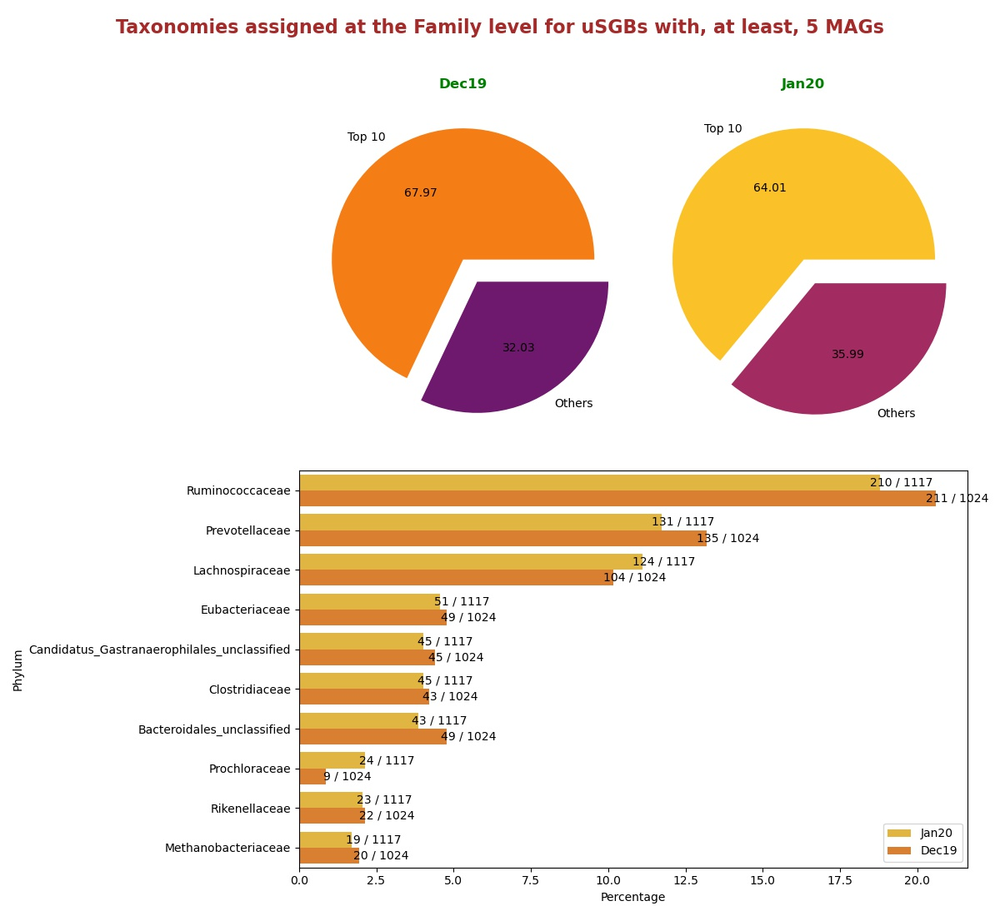
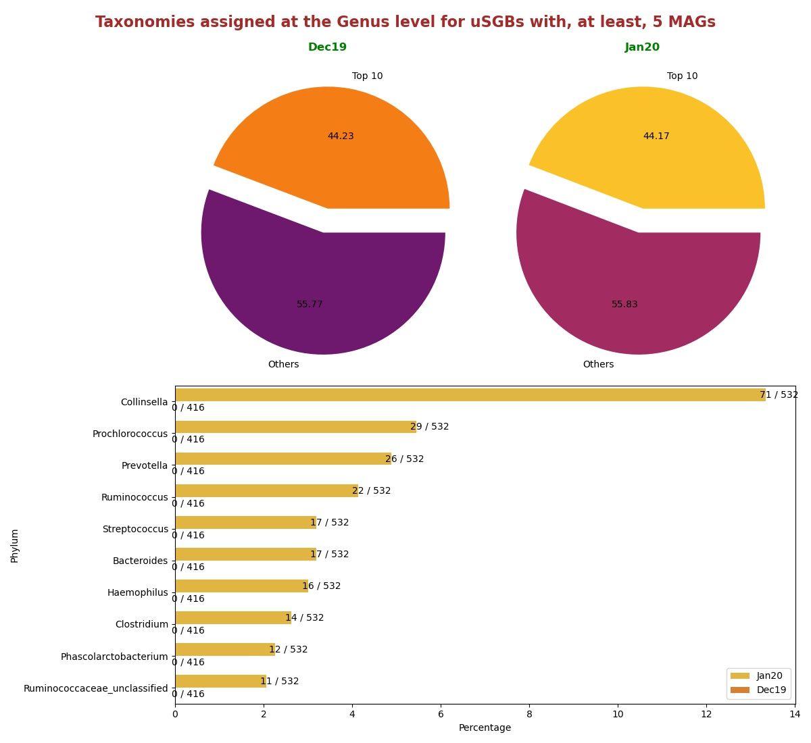

# Comparisons between version Jan20 and Dec19
In this document there are statistics to compare the releases Jan20 and Dec19.

## How many SGBs are new
Histogram showing the number of uSGBs and kSGBs between Jan20 and Dec19.

## How many SGBs change type
Histogram showing the number of kSGBs that change to uSGBs and viceversa from Dec19 and Jan20.

### [Here](pages/df_second_fig2.md) the list of SGBs that change SGB type

### [Here](pages/df_second_fig2_upgrade.md) the list of uSGBs that change to kSGB

### [Here](pages/df_second_fig2_downgrade.md) the list of kSGBs that change to uSGB

<table><tr><th colspan = '4' style = 'text-align: center'>Phylum</th><th colspan = '4' style = 'text-align: center'>Family</th><th colspan = '4' style = 'text-align: center'>Genus</th><th colspan = '4' style = 'text-align: center'>Species</th></tr><tr><th colspan = '2' style = 'text-align: center'>Dec19</th><th colspan = '2' style = 'text-align: center'>Jan20</th><th colspan = '2' style = 'text-align: center'>Dec19</th><th colspan = '2' style = 'text-align: center'>Jan20</th><th colspan = '2' style = 'text-align: center'>Dec19</th><th colspan = '2' style = 'text-align: center'>Jan20</th><th colspan = '2' style = 'text-align: center'>Dec19</th><th colspan = '2' style = 'text-align: center'>Jan20</th></tr><tr><th style = 'text-align: center'>Name</th><th style = 'text-align: center'>Count</th><th style = 'text-align: center'>Name</th><th style = 'text-align: center'>Count</th><th style = 'text-align: center'>Name</th><th style = 'text-align: center'>Count</th><th style = 'text-align: center'>Name</th><th style = 'text-align: center'>Count</th><th style = 'text-align: center'>Name</th><th style = 'text-align: center'>Count</th><th style = 'text-align: center'>Name</th><th style = 'text-align: center'>Count</th><th style = 'text-align: center'>Name</th><th style = 'text-align: center'>Count</th><th style = 'text-align: center'>Name</th><th style = 'text-align: center'>Count</th></tr><tr><td>Firmicutes</td><td>5995</td><td>Firmicutes</td><td>7027</td><td>Prochloraceae</td><td>1099</td><td>Prochloraceae</td><td>701</td><td>Prochlorococcus</td><td>1063</td><td>Prochlorococcus</td><td>639</td><td>Rhizobiales bacterium</td><td>91</td><td>Rhizobiales bacterium</td><td>91</td></tr><tr><td>Proteobacteria</td><td>4716</td><td>Proteobacteria</td><td>6180</td><td>Ruminococcaceae</td><td>496</td><td>Ruminococcaceae</td><td>515</td><td>Collinsella</td><td>331</td><td>Collinsella</td><td>332</td><td>Buchnera aphidicola</td><td>49</td><td>Buchnera aphidicola</td><td>49</td></tr><tr><td>Bacteroidetes</td><td>2294</td><td>Bacteroidetes</td><td>2922</td><td>Prevotellaceae</td><td>324</td><td>Prevotellaceae</td><td>309</td><td>Burkholderia</td><td>148</td><td>Streptococcus</td><td>158</td><td>Pseudomonas fluorescens</td><td>48</td><td>Pseudomonas fluorescens</td><td>47</td></tr><tr><td>Actinobacteria</td><td>1627</td><td>Actinobacteria</td><td>2338</td><td>Lachnospiraceae</td><td>239</td><td>Lachnospiraceae</td><td>264</td><td>Thaumarchaeota unclassified</td><td>123</td><td>Microbacterium</td><td>108</td><td>Streptococcus mitis</td><td>35</td><td>Streptococcus mitis</td><td>35</td></tr><tr><td>Euryarchaeota</td><td>348</td><td>Euryarchaeota</td><td>363</td><td>Clostridiales unclassified</td><td>138</td><td>Candidatus Gastranaerophilales unclassified</td><td>123</td><td>Kineosporia</td><td>111</td><td>Alphaproteobacteria unclassified</td><td>80</td><td>Pseudomonas viridiflava</td><td>31</td><td>Pseudomonas viridiflava</td><td>29</td></tr><tr><td>Candidatus Saccharibacteria</td><td>260</td><td>Candidatus Saccharibacteria</td><td>298</td><td>Bacteroidales unclassified</td><td>128</td><td>Flavobacteriaceae</td><td>123</td><td>Streptococcus</td><td>108</td><td>Prevotella</td><td>67</td><td>Escherichia coli</td><td>29</td><td>Stenotrophomonas maltophilia</td><td>26</td></tr><tr><td>Tenericutes</td><td>213</td><td>Tenericutes</td><td>261</td><td>Flavobacteriaceae</td><td>127</td><td>Pelagibacteraceae</td><td>120</td><td>Alphaproteobacteria unclassified</td><td>86</td><td>Campylobacter</td><td>63</td><td>Candidatus Hodgkinia cicadicola</td><td>27</td><td>Prochlorococcus marinus</td><td>21</td></tr><tr><td>Fusobacteria</td><td>193</td><td>Fusobacteria</td><td>236</td><td>Pelagibacteraceae</td><td>126</td><td>Clostridiales unclassified</td><td>118</td><td>Synechococcus</td><td>83</td><td>Haemophilus</td><td>56</td><td>Candidatus Pelagibacter ubique</td><td>27</td><td>Pseudomonas putida</td><td>21</td></tr><tr><td>Spirochaetes</td><td>183</td><td>Spirochaetes</td><td>226</td><td>Candidatus Gastranaerophilales unclassified</td><td>125</td><td>Bacteroidales unclassified</td><td>117</td><td>Pelagibacteraceae unclassified</td><td>62</td><td>Synechococcus</td><td>54</td><td>Stenotrophomonas maltophilia</td><td>26</td><td>Pseudomonas stutzeri</td><td>20</td></tr><tr><td>Chloroflexi</td><td>162</td><td>Chloroflexi</td><td>187</td><td>Burkholderiaceae</td><td>108</td><td>Clostridiaceae</td><td>106</td><td>Prevotella</td><td>61</td><td>Clostridium</td><td>51</td><td>Pseudomonas putida</td><td>24</td><td>Streptococcus oralis</td><td>20</td></tr><tr style = 'font-weight: bold'><td>Others</td><td>1375</td><td>Others</td><td>1472</td><td>Others</td><td>3299</td><td>Others</td><td>2953</td><td>Others</td><td>2340</td><td>Others</td><td>2105</td><td>Others</td><td>17963</td><td>Others</td><td>16830</td></tr></table>

## Taxonomies assigned at the Phylum level for uSGBs with, at least, 5 MAGs
Percentage of uSGBs with, at least, 5 MAGs assigned to different phylum.

## Taxonomies assigned at the Family level for uSGBs with, at least, 5 MAGs
Percentage of uSGBs with, at least, 5 MAGs assigned to different families. The top 10 assigned families are shown in the histogram in the right.

## Taxonomies assigned at the Genus level for uSGBs with, at least, 5 MAGs
Percentage of uSGBs with, at least, 5 MAGs assigned to different genus. The top 10 assigned genus are shown in the histogram in the right.

