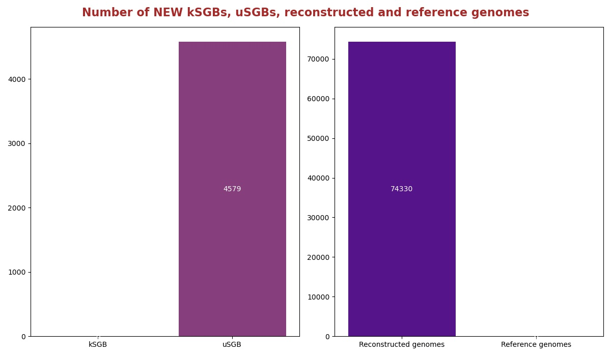

# Report for the Jan22 release
[Here](Jun21-Jan22_comparison.md) the comparison between Jun21 and Jan22 releases.

## Releases overview

Release | Total MAGs | Total Reference Genomes | New MAGs | New Reference Genomes | Total kSGBs | Total uSGBs | New kSGBs | New uSGBs | Unknown to known
------------ | ------------- | ------------- | ------------- | ------------- | ------------- | ------------- | ------------- | ------------- | -------------
[Jan19](../Jan19/README.md)	| 160267	| 75446	| 160267	| 75446	| 9641	| 6690	| 9641	| 6690	| 0
[May19](../May19/README.md)	| 163252	| 75446	| 2985	| 0	| 9641	| 7699	| 0	| 1009	| 0
[Jun19](../Jun19/README.md)	| 165219	| 100133	| 1967	| 24687	| 11355	| 8478	| 1555	| 938	| 159
[Jul19](../Jul19/README.md)	| 166454	| 100133	| 1235	| 0	| 11355	| 9537	| 0	| 1059	| 0
[Aug19](../Aug19/README.md)	| 170038	| 100133	| 3584	| 0	| 11355	| 9683	| 0	| 146	| 0
[Sep19](../Sep19/README.md)	| 170148	| 138564	| 110	| 38431	| 16529	| 9420	| 4909	| 2	| 265
[Oct19](../Oct19/README.md)	| 178808	| 138564	| 8660	| 0	| 16529	| 12720	| 0	| 3300	| 0
[Nov19](../Nov19/README.md)	| 214092	| 138588	| 35284	| 24	| 16533	| 16822	| 4	| 4102	| 0
[Dec19](../Dec19/README.md)	| 343550	| 141702	| 129458	| 3114	| 18350	| 28209	| 1768	| 11436	| 49
[Jan20](../Jan20/README.md)	| 427414	| 138651	| 83864	| 0	| 17190	| 30672	| 4	| 6995	| 17
[Jul20](../Jul20/README.md)	| 436838	| 139472	| 9424	| 821	| 17527	| 33793	| 84	| 3374	| 253
[Sep20](../Sep20/README.md)	| 447463	| 139471	| 10625	| 0	| 17527	| 34276	| 0	| 483	| 0
[Nov20](../Nov20/README.md)	| 499902	| 139478	| 52439	| 7	| 17512	| 37458	| 3	| 3526	| 19
[Dec20](../Dec20/README.md)	| 505828	| 139478	| 5926	| 0	| 17505	| 37502	| 0	| 210	| 5
[Jan21](../Jan21/README.md)	| 560076	| 169119	| 54248	| 29641	| 23741	| 47186	| 4762	| 11274	| 1492
[Jun21](../Jun21/README.md)	| 603741	| 173302	| 43665	| 4183	| 23315	| 51725	| 1464	| 3272	| 209
[Jan22](../Jan22/README.md)	| 678071	| 173302	| 74330	| 0	| 23315	| 56304	| 0	| 4579	| 0

## Jan22 release overview

Level | Bacteria | Archaea | Eukaryota | Total
------------ | ------------- | ------------- | ------------- | -------------
Other	| 35575	| 929	| 0	| 36504	| 0.0
Species	| 22659	| 656	| 0	| 23315	| 0.0
Family	| 9953	| 354	| 0	| 10307	| 0.0
Genus	| 9299	| 194	| 0	| 9493	| 0.0

Histogram showing the number of `kSGBs`, `uSGBs`, `reconstructed` and `reference genomes` included in Jan22

Histogram showing the number of **NEW** `kSGBs`, `uSGBs`, `reconstructed` and `reference genomes` included in Jan22

## Distribution of the kSGBs by number of genomes in the database
Histograms showing the distribution density of kSGBs by the number of genomes in the database. In particular, the number of kSGBs that have respectively from 0 to 10 reconstructed and reference genomes are shown. In the 12th column there is a grouping of all the others with more than 10.

## Distribution of the uSGBs by number of genomes in the database
Histograms showing the distribution density of uSGBs by the number of genomes in the database. In particular, the number of uSGBs that have respectively from 0 to 10 reconstructed and reference genomes are shown. In the 12th column there is a grouping of all the others with more than 10.

## Number of SGBs by the level of assigned taxonomy
Histogram showing the number of SGBs by their lower level of known taxonomy.

<table><tr><th colspan = '2' style = 'text-align: center'>Phylum</th><th colspan = '2' style = 'text-align: center'>Family</th><th colspan = '2' style = 'text-align: center'>Genus</th><th colspan = '2' style = 'text-align: center'>Species</th></tr><tr><th style = 'text-align: center'>Name</th><th style = 'text-align: center'>Count</th><th style = 'text-align: center'>Name</th><th style = 'text-align: center'>Count</th><th style = 'text-align: center'>Name</th><th style = 'text-align: center'>Count</th><th style = 'text-align: center'>Name</th><th style = 'text-align: center'>Count</th></tr><tr><td>Proteobacteria</td><td>12594</td><td>Ruminococcaceae</td><td>607</td><td>Prochlorococcus</td><td>797</td><td>Rhizobiales bacterium</td><td>90</td></tr><tr><td>Firmicutes</td><td>9926</td><td>Prochloraceae</td><td>563</td><td>Candidatus Saccharibacteria unclassified</td><td>639</td><td>Pseudomonas fluorescens</td><td>67</td></tr><tr><td>Bacteroidetes</td><td>4876</td><td>Prevotellaceae</td><td>342</td><td>Pelagibacteraceae unclassified</td><td>610</td><td>Buchnera aphidicola</td><td>53</td></tr><tr><td>Actinobacteria</td><td>4395</td><td>Prolixibacteraceae</td><td>270</td><td>Campylobacter</td><td>347</td><td>Streptococcus mitis</td><td>41</td></tr><tr><td>Candidatus Saccharibacteria</td><td>507</td><td>Rhodobacteraceae</td><td>263</td><td>Collinsella</td><td>294</td><td>Blattabacterium cuenoti</td><td>39</td></tr><tr><td>Euryarchaeota</td><td>478</td><td>Bacteria unclassified</td><td>212</td><td>Candidatus Pelagibacter</td><td>233</td><td>Lachnospiraceae bacterium</td><td>33</td></tr><tr><td>Verrucomicrobia</td><td>389</td><td>Bacteroidales unclassified</td><td>205</td><td>Streptococcus</td><td>223</td><td>Prochlorococcus marinus</td><td>29</td></tr><tr><td>Spirochaetes</td><td>328</td><td>Flavobacteriaceae</td><td>184</td><td>Bacteria unclassified</td><td>174</td><td>Stenotrophomonas maltophilia</td><td>28</td></tr><tr><td>Planctomycetes</td><td>317</td><td>Pelagibacteraceae</td><td>174</td><td>Pelagibacterales unclassified</td><td>158</td><td>Pseudomonas viridiflava</td><td>26</td></tr><tr><td>Tenericutes</td><td>264</td><td>Candidatus Gastranaerophilales unclassified</td><td>137</td><td>Actinomyces</td><td>143</td><td>bacterium</td><td>25</td></tr><tr style = 'font-weight: bold'><td>Others</td><td>2430</td><td>Others</td><td>5831</td><td>Others</td><td>5454</td><td>Others</td><td>22744</td></tr></table>

## Number of uSGBs with, at least 5 MAGs, by the level of assigned taxonomy
Histogram showing the number of uSGBs, with at least 5 MAGs in the database, by their lower level of known taxonomy.

## Taxonomies assigned at the Phylum level for uSGBs with, at least, 5 MAGs
Percentage of uSGBs with, at least, 5 MAGs assigned to different phylum.

## Taxonomies assigned at the Family level for uSGBs with, at least, 5 MAGs
Percentage of uSGBs with, at least, 5 MAGs assigned to different families. The top 10 assigned families are shown in the histogram in the right.

## Taxonomies assigned at the Genus level for uSGBs with, at least, 5 MAGs
Percentage of uSGBs with, at least, 5 MAGs assigned to different genus. The top 10 assigned genus are shown in the histogram in the right.

## Number of alternative taxonomies for the kSGBs
Histogram representing the distribution of kSGBs by the number of alternative taxonomies. 

## Distribution of kSGBs by their proportion of reference genomes belonging to the assigned taxonomy
Histogram showing the distribution of kSGBs by the proportion of the reference genomes belonging to the assigned taxonomy.

## SGBs with 2 alternative taxonomies in a 50 / 50 proportion
Histogram reporting the SGBs with 2 alternative taxonomies in a 50 / 50 genomes proportion. We defined 3 groups: "Binary : Binary", "Binary : Non-Binary" and "Non-Binary : Non-Binary". Binary we mean that the taxonomy respects the criteria values set by the regular expression reported here " `(.*(C|c)andidat(e|us)_.*)|(.*_sp(_.*|$))|((.*_|^)(b|B)acterium(_.*|$))|(.*(eury|)archaeo(n_|te).*)|(.*(endo|)symbiont.*|.*genomosp_.* |.*unidentified.*|.*_bacteria_.*|.*_taxon_.*|.*_et_al_.*|.*_and_.*|.*(cyano|proteo|actino)bacterium_.*)` ", while Non-Binary mean the opposite.

### [Here](pages/df_first_fig12.md) you can see the list of SGBs.

## Taxonomic differences in the alternative taxonomies for the SGBs with 2 alternative taxonomues in a 50 / 50 proporyion
Histogram showing, for the `Binary : Binary` group the number of SGBs by the higher taxonomic level that differs between the two alternative taxonomies.

### [Here](pages/df_first_fig13.md) you can see the list of SGBs.

The same as the previous one applies to this but with `Binary : Non-Binary` (obiously also the complementary one).

### [Here](pages/df_first_fig14.md) you can see the list of SGBs.

The same as the previous one applies to this but with `Non-Binary : Non-Binary`.

### [Here](pages/df_first_fig15.md) you can see the list of SGBs.

## Taxonomic families per FGB
This graph shows the number of families present in a single FGB. The first column shows the number of FGBs that have associated only one family, while the second shows thos that have that associated more than one.

### [Here](pages/df_first_fig16.md) the list of FGBs with their families

### [Here](pages/df_first_fig16_more1.md) the list of FGBs with more than one family

### [Here](pages/df_first_fig16_only1.md) the list of FGBs with only one familiy

## Taxonomic genera present in several FGBs
Histogram showing the number of genera appearing in one or more FGBs. In the first column there are the number of those that appear only in one FGB, while in the second those that appear in more than one.

### [Here](pages/df_first_fig17.md) the list of FGBs with their genus

### [Here](pages/df_first_fig17_more1.md) the list of FGBs with more than one genus

### [Here](pages/df_first_fig17_only1.md) the list of FGBs with only one genus

