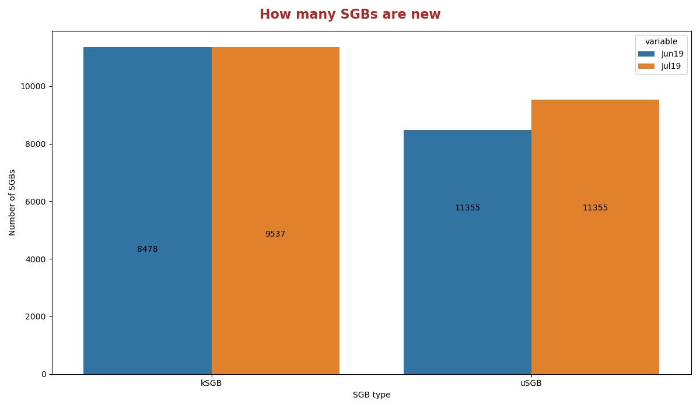
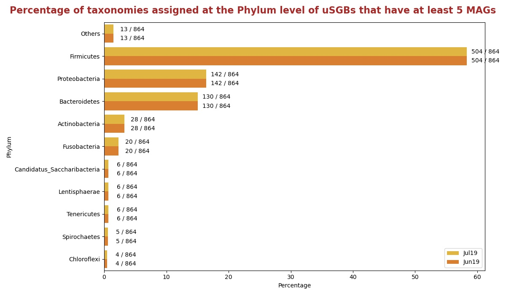
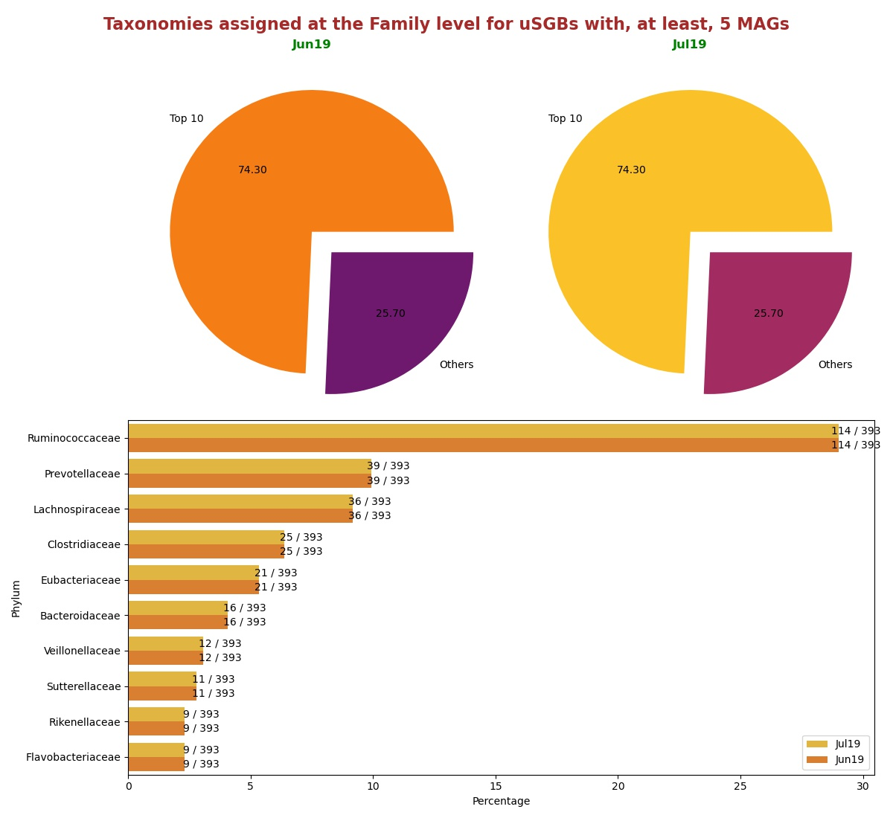
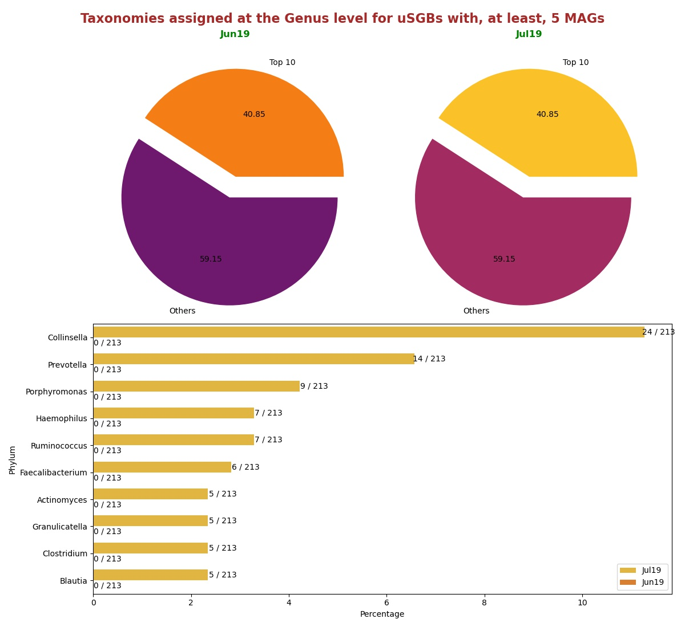

# Comparisons between version [Jul19](README.md) and [Jun19](../Jun19/README.md)
In this document there are statistics to compare the releases Jul19 and Jun19.

## How many SGBs are new
Histogram showing the number of uSGBs and kSGBs between Jul19 and Jun19.

## How many SGBs change type
Histogram showing the number of kSGBs that change to uSGBs and viceversa from Jun19 and Jul19.

### [Here](pages/df_second_fig2.md) the list of SGBs that change SGB type

### [Here](pages/df_second_fig2_upgrade.md) the list of uSGBs that change to kSGB

### [Here](pages/df_second_fig2_downgrade.md) the list of kSGBs that change to uSGB

<table><tr><th colspan = '4' style = 'text-align: center'>Phylum</th><th colspan = '4' style = 'text-align: center'>Family</th><th colspan = '4' style = 'text-align: center'>Genus</th><th colspan = '4' style = 'text-align: center'>Species</th></tr><tr><th colspan = '2' style = 'text-align: center'>Jun19</th><th colspan = '2' style = 'text-align: center'>Jul19</th><th colspan = '2' style = 'text-align: center'>Jun19</th><th colspan = '2' style = 'text-align: center'>Jul19</th><th colspan = '2' style = 'text-align: center'>Jun19</th><th colspan = '2' style = 'text-align: center'>Jul19</th><th colspan = '2' style = 'text-align: center'>Jun19</th><th colspan = '2' style = 'text-align: center'>Jul19</th></tr><tr><th style = 'text-align: center'>Name</th><th style = 'text-align: center'>Count</th><th style = 'text-align: center'>Name</th><th style = 'text-align: center'>Count</th><th style = 'text-align: center'>Name</th><th style = 'text-align: center'>Count</th><th style = 'text-align: center'>Name</th><th style = 'text-align: center'>Count</th><th style = 'text-align: center'>Name</th><th style = 'text-align: center'>Count</th><th style = 'text-align: center'>Name</th><th style = 'text-align: center'>Count</th><th style = 'text-align: center'>Name</th><th style = 'text-align: center'>Count</th><th style = 'text-align: center'>Name</th><th style = 'text-align: center'>Count</th></tr><tr><td>Firmicutes</td><td>2066</td><td>Firmicutes</td><td>2478</td><td>Ruminococcaceae</td><td>300</td><td>Ruminococcaceae</td><td>300</td><td>Collinsella</td><td>330</td><td>Collinsella</td><td>330</td><td>Pseudomonas fluorescens</td><td>36</td><td>Pseudomonas fluorescens</td><td>36</td></tr><tr><td>Proteobacteria</td><td>1378</td><td>Proteobacteria</td><td>1636</td><td>Lachnospiraceae</td><td>130</td><td>Lachnospiraceae</td><td>130</td><td>Streptococcus</td><td>107</td><td>Streptococcus</td><td>107</td><td>Streptococcus mitis</td><td>27</td><td>Streptococcus mitis</td><td>27</td></tr><tr><td>Bacteroidetes</td><td>724</td><td>Bacteroidetes</td><td>819</td><td>Prevotellaceae</td><td>105</td><td>Prevotellaceae</td><td>105</td><td>Campylobacter</td><td>59</td><td>Campylobacter</td><td>59</td><td>Candidatus Hodgkinia cicadicola</td><td>26</td><td>Candidatus Hodgkinia cicadicola</td><td>26</td></tr><tr><td>Actinobacteria</td><td>330</td><td>Actinobacteria</td><td>474</td><td>Clostridiaceae</td><td>80</td><td>Clostridiaceae</td><td>80</td><td>Haemophilus</td><td>55</td><td>Haemophilus</td><td>55</td><td>Stenotrophomonas maltophilia</td><td>21</td><td>Stenotrophomonas maltophilia</td><td>21</td></tr><tr><td>Fusobacteria</td><td>109</td><td>Fusobacteria</td><td>116</td><td>Flavobacteriaceae</td><td>77</td><td>Flavobacteriaceae</td><td>77</td><td>Prevotella</td><td>50</td><td>Prevotella</td><td>50</td><td>Pseudomonas stutzeri</td><td>20</td><td>Pseudomonas stutzeri</td><td>20</td></tr><tr><td>Tenericutes</td><td>84</td><td>Euryarchaeota</td><td>88</td><td>Candidatus Saccharibacteria unclassified</td><td>64</td><td>Candidatus Saccharibacteria unclassified</td><td>64</td><td>Ruminococcus</td><td>31</td><td>Ruminococcus</td><td>31</td><td>Prochlorococcus marinus</td><td>17</td><td>Prochlorococcus marinus</td><td>17</td></tr><tr><td>Euryarchaeota</td><td>62</td><td>Tenericutes</td><td>88</td><td>Burkholderiaceae</td><td>54</td><td>Burkholderiaceae</td><td>54</td><td>Actinomyces</td><td>30</td><td>Actinomyces</td><td>30</td><td>Pseudomonas putida</td><td>17</td><td>Pseudomonas putida</td><td>17</td></tr><tr><td>Spirochaetes</td><td>50</td><td>Spirochaetes</td><td>85</td><td>Eubacteriaceae</td><td>46</td><td>Eubacteriaceae</td><td>46</td><td>Faecalibacterium</td><td>29</td><td>Faecalibacterium</td><td>29</td><td>Bacillus cereus</td><td>15</td><td>Bacillus cereus</td><td>15</td></tr><tr><td>Candidatus Saccharibacteria</td><td>45</td><td>Candidatus Saccharibacteria</td><td>61</td><td>Bacteroidaceae</td><td>41</td><td>Bacteroidaceae</td><td>41</td><td>Clostridium</td><td>27</td><td>Clostridium</td><td>27</td><td>Gilliamella apicola</td><td>15</td><td>Gilliamella apicola</td><td>15</td></tr><tr><td>Cyanobacteria</td><td>43</td><td>Chloroflexi</td><td>57</td><td>Sphingomonadaceae</td><td>39</td><td>Sphingomonadaceae</td><td>39</td><td>Rothia</td><td>25</td><td>Rothia</td><td>25</td><td>Streptococcus oralis</td><td>15</td><td>Streptococcus oralis</td><td>15</td></tr><tr style = 'font-weight: bold'><td>Others</td><td>246</td><td>Others</td><td>279</td><td>Others</td><td>925</td><td>Others</td><td>940</td><td>Others</td><td>737</td><td>Others</td><td>737</td><td>Others</td><td>11146</td><td>Others</td><td>11146</td></tr></table>

## Taxonomies assigned at the Phylum level for uSGBs with, at least, 5 MAGs
Percentage of uSGBs with, at least, 5 MAGs assigned to different phylum.

## Taxonomies assigned at the Family level for uSGBs with, at least, 5 MAGs
Percentage of uSGBs with, at least, 5 MAGs assigned to different families. The top 10 assigned families are shown in the histogram in the right.

## Taxonomies assigned at the Genus level for uSGBs with, at least, 5 MAGs
Percentage of uSGBs with, at least, 5 MAGs assigned to different genus. The top 10 assigned genus are shown in the histogram in the right.

