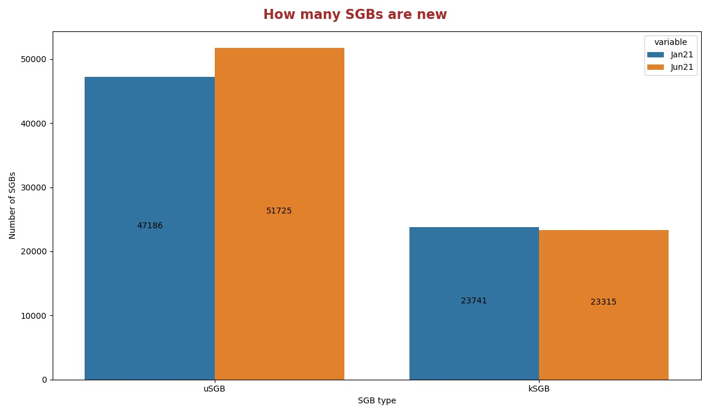
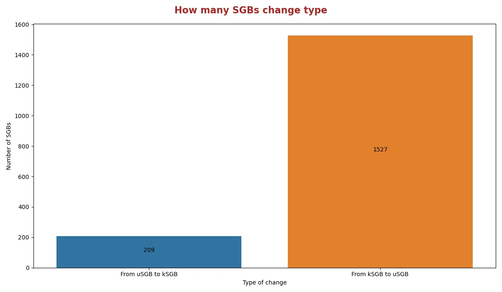
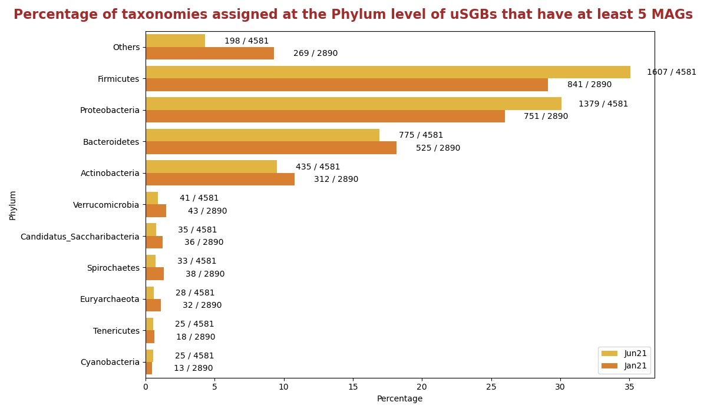
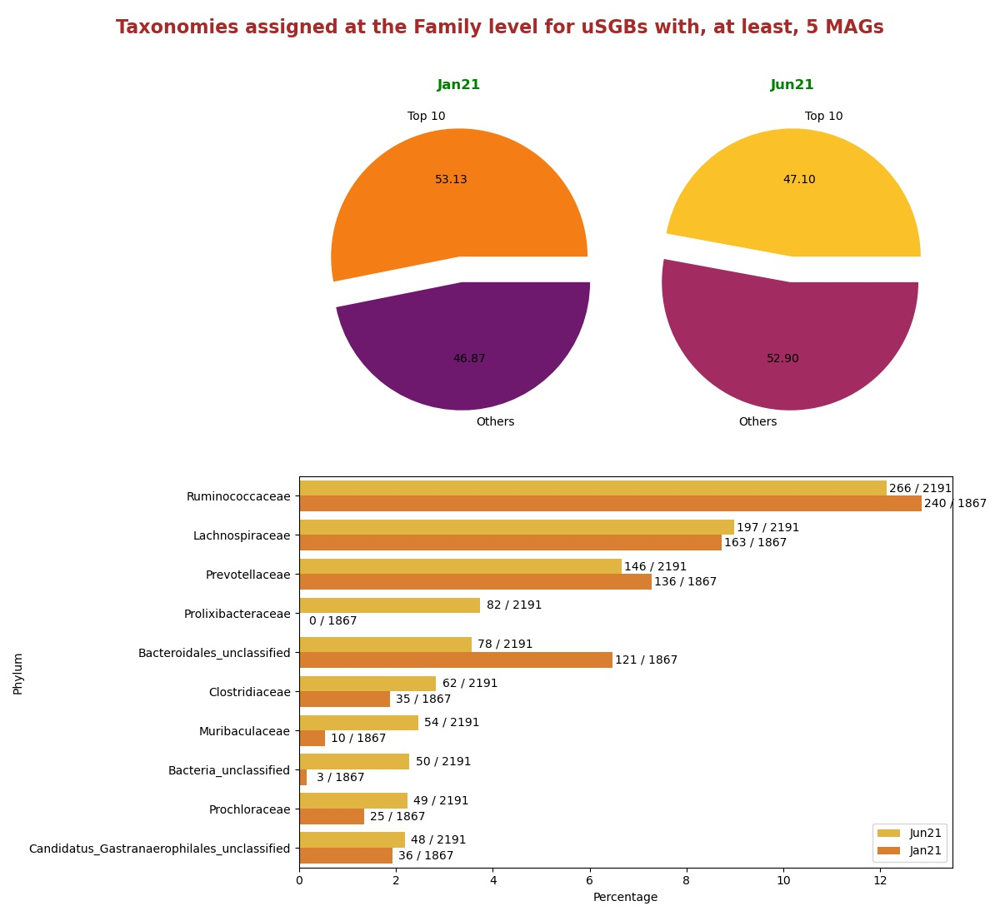
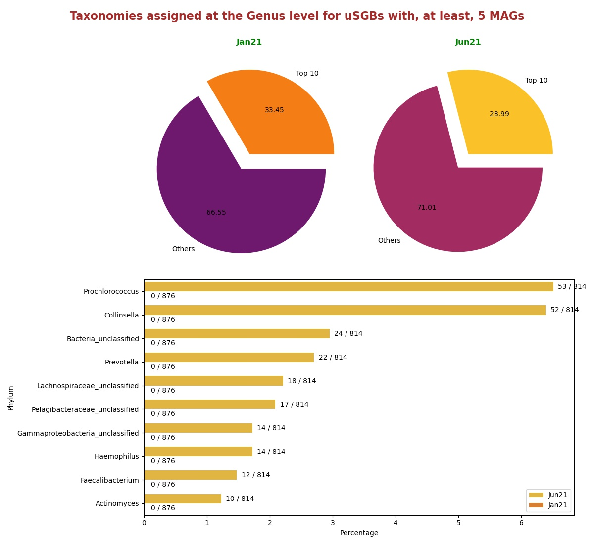

# Comparisons between version Jun21 and Jan21
In this document there are statistics to compare the releases Jun21 and Jan21.

## How many SGBs are new
Histogram showing the number of uSGBs and kSGBs between Jun21 and Jan21.

## How many SGBs change type
Histogram showing the number of kSGBs that change to uSGBs and viceversa from Jan21 and Jun21.

### [Here](pages/df_second_fig2.md) the list of SGBs that change SGB type

### [Here](pages/df_second_fig2_upgrade.md) the list of uSGBs that change to kSGB

### [Here](pages/df_second_fig2_downgrade.md) the list of kSGBs that change to uSGB

<table><tr><th colspan = '4' style = 'text-align: center'>Phylum</th><th colspan = '4' style = 'text-align: center'>Family</th><th colspan = '4' style = 'text-align: center'>Genus</th><th colspan = '4' style = 'text-align: center'>Species</th></tr><tr><th colspan = '2' style = 'text-align: center'>Jan21</th><th colspan = '2' style = 'text-align: center'>Jun21</th><th colspan = '2' style = 'text-align: center'>Jan21</th><th colspan = '2' style = 'text-align: center'>Jun21</th><th colspan = '2' style = 'text-align: center'>Jan21</th><th colspan = '2' style = 'text-align: center'>Jun21</th><th colspan = '2' style = 'text-align: center'>Jan21</th><th colspan = '2' style = 'text-align: center'>Jun21</th></tr><tr><th style = 'text-align: center'>Name</th><th style = 'text-align: center'>Count</th><th style = 'text-align: center'>Name</th><th style = 'text-align: center'>Count</th><th style = 'text-align: center'>Name</th><th style = 'text-align: center'>Count</th><th style = 'text-align: center'>Name</th><th style = 'text-align: center'>Count</th><th style = 'text-align: center'>Name</th><th style = 'text-align: center'>Count</th><th style = 'text-align: center'>Name</th><th style = 'text-align: center'>Count</th><th style = 'text-align: center'>Name</th><th style = 'text-align: center'>Count</th><th style = 'text-align: center'>Name</th><th style = 'text-align: center'>Count</th></tr><tr><td>Proteobacteria</td><td>9482</td><td>Proteobacteria</td><td>12219</td><td>Ruminococcaceae</td><td>706</td><td>Ruminococcaceae</td><td>602</td><td>Prochlorococcus</td><td>732</td><td>Prochlorococcus</td><td>763</td><td>Clostridia bacterium</td><td>405</td><td>Rhizobiales bacterium</td><td>90</td></tr><tr><td>Firmicutes</td><td>7588</td><td>Firmicutes</td><td>9656</td><td>Clostridia unclassified</td><td>578</td><td>Prochloraceae</td><td>496</td><td>Pelagibacteraceae unclassified</td><td>608</td><td>Pelagibacteraceae unclassified</td><td>608</td><td>Ruminococcaceae bacterium</td><td>233</td><td>Pseudomonas fluorescens</td><td>67</td></tr><tr><td>Bacteroidetes</td><td>4193</td><td>Bacteroidetes</td><td>4752</td><td>Prochloraceae</td><td>465</td><td>Prevotellaceae</td><td>332</td><td>Collinsella</td><td>297</td><td>Collinsella</td><td>294</td><td>Lachnospiraceae bacterium</td><td>145</td><td>Buchnera aphidicola</td><td>53</td></tr><tr><td>Actinobacteria</td><td>3478</td><td>Actinobacteria</td><td>4043</td><td>Lachnospiraceae</td><td>387</td><td>Prolixibacteraceae</td><td>269</td><td>Clostridia unclassified</td><td>260</td><td>Candidatus Pelagibacter</td><td>233</td><td>Rhizobiales bacterium</td><td>88</td><td>Streptococcus mitis</td><td>41</td></tr><tr><td>Euryarchaeota</td><td>522</td><td>Euryarchaeota</td><td>473</td><td>Bacteroidales unclassified</td><td>374</td><td>Rhodobacteraceae</td><td>248</td><td>Candidatus Pelagibacter</td><td>232</td><td>Pelagibacterales unclassified</td><td>158</td><td>Bacilli bacterium</td><td>81</td><td>Blattabacterium cuenoti</td><td>39</td></tr><tr><td>Candidatus Saccharibacteria</td><td>457</td><td>Candidatus Saccharibacteria</td><td>450</td><td>Prevotellaceae</td><td>320</td><td>Streptomycetaceae</td><td>216</td><td>Ruminococcaceae unclassified</td><td>171</td><td>Bacteria unclassified</td><td>125</td><td>Bacteroidales bacterium</td><td>77</td><td>Lachnospiraceae bacterium</td><td>33</td></tr><tr><td>Verrucomicrobia</td><td>390</td><td>Verrucomicrobia</td><td>383</td><td>Streptomycetaceae</td><td>212</td><td>Bacteria unclassified</td><td>212</td><td>Pelagibacterales unclassified</td><td>158</td><td>Streptococcus</td><td>115</td><td>Pseudomonas fluorescens</td><td>62</td><td>Prochlorococcus marinus</td><td>29</td></tr><tr><td>Spirochaetes</td><td>335</td><td>Spirochaetes</td><td>322</td><td>Bacilli unclassified</td><td>155</td><td>Bacteroidales unclassified</td><td>205</td><td>Microbacterium</td><td>138</td><td>Candidatus Saccharibacteria unclassified</td><td>88</td><td>Buchnera aphidicola</td><td>53</td><td>Stenotrophomonas maltophilia</td><td>28</td></tr><tr><td>Planctomycetes</td><td>300</td><td>Planctomycetes</td><td>312</td><td>Flavobacteriaceae</td><td>151</td><td>Flavobacteriaceae</td><td>181</td><td>Streptococcus</td><td>122</td><td>Campylobacter</td><td>83</td><td>Bacteroidaceae bacterium</td><td>47</td><td>Pseudomonas viridiflava</td><td>26</td></tr><tr><td>Chloroflexi</td><td>276</td><td>Cyanobacteria</td><td>251</td><td>Rhodobacteraceae</td><td>151</td><td>Candidatus Gastranaerophilales unclassified</td><td>136</td><td>Lachnospiraceae unclassified</td><td>121</td><td>Alphaproteobacteria unclassified</td><td>76</td><td>Streptococcus mitis</td><td>42</td><td>bacterium</td><td>25</td></tr><tr style = 'font-weight: bold'><td>Others</td><td>3614</td><td>Others</td><td>2401</td><td>Others</td><td>6033</td><td>Others</td><td>5601</td><td>Others</td><td>4150</td><td>Others</td><td>3889</td><td>Others</td><td>22508</td><td>Others</td><td>22744</td></tr></table>

## Taxonomies assigned at the Phylum level for uSGBs with, at least, 5 MAGs
Percentage of uSGBs with, at least, 5 MAGs assigned to different phylum.

## Taxonomies assigned at the Family level for uSGBs with, at least, 5 MAGs
Percentage of uSGBs with, at least, 5 MAGs assigned to different families. The top 10 assigned families are shown in the histogram in the right.

## Taxonomies assigned at the Genus level for uSGBs with, at least, 5 MAGs
Percentage of uSGBs with, at least, 5 MAGs assigned to different genus. The top 10 assigned genus are shown in the histogram in the right.

