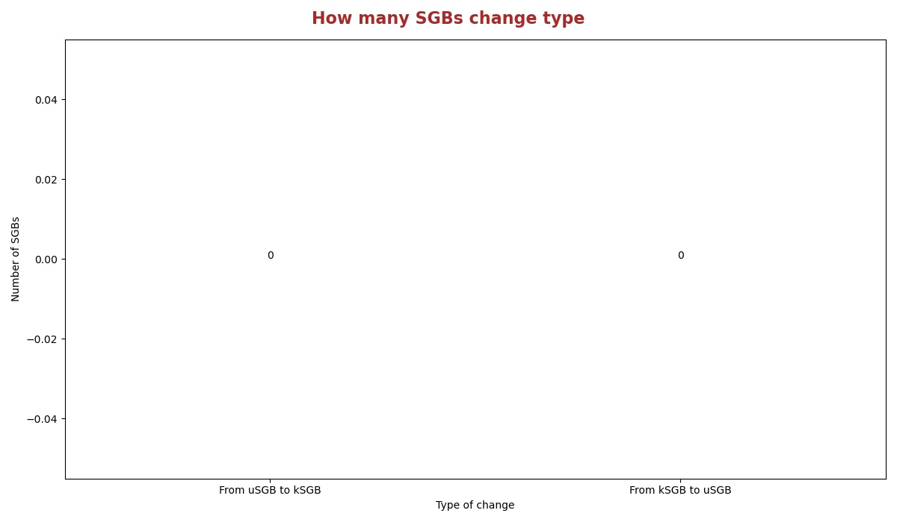

# Comparisons between version [Mar22](README.md) and [Jan22](../Jan22/README.md)
In this document there are statistics to compare the releases Mar22 and Jan22.

## How many SGBs are new
Histogram showing the number of uSGBs and kSGBs between Mar22 and Jan22.

## How many SGBs change type
Histogram showing the number of kSGBs that change to uSGBs and viceversa from Jan22 and Mar22.

### [Here](pages/df_second_fig2.md) the list of SGBs that change SGB type

### [Here](pages/df_second_fig2_upgrade.md) the list of uSGBs that change to kSGB

### [Here](pages/df_second_fig2_downgrade.md) the list of kSGBs that change to uSGB

<table><tr><th colspan = '4' style = 'text-align: center'>Phylum</th><th colspan = '4' style = 'text-align: center'>Family</th><th colspan = '4' style = 'text-align: center'>Genus</th><th colspan = '4' style = 'text-align: center'>Species</th></tr><tr><th colspan = '2' style = 'text-align: center'>Jan22</th><th colspan = '2' style = 'text-align: center'>Mar22</th><th colspan = '2' style = 'text-align: center'>Jan22</th><th colspan = '2' style = 'text-align: center'>Mar22</th><th colspan = '2' style = 'text-align: center'>Jan22</th><th colspan = '2' style = 'text-align: center'>Mar22</th><th colspan = '2' style = 'text-align: center'>Jan22</th><th colspan = '2' style = 'text-align: center'>Mar22</th></tr><tr><th style = 'text-align: center'>Name</th><th style = 'text-align: center'>Count</th><th style = 'text-align: center'>Name</th><th style = 'text-align: center'>Count</th><th style = 'text-align: center'>Name</th><th style = 'text-align: center'>Count</th><th style = 'text-align: center'>Name</th><th style = 'text-align: center'>Count</th><th style = 'text-align: center'>Name</th><th style = 'text-align: center'>Count</th><th style = 'text-align: center'>Name</th><th style = 'text-align: center'>Count</th><th style = 'text-align: center'>Name</th><th style = 'text-align: center'>Count</th><th style = 'text-align: center'>Name</th><th style = 'text-align: center'>Count</th></tr><tr><td>Proteobacteria</td><td>12594</td><td>Proteobacteria</td><td>12717</td><td>Ruminococcaceae</td><td>607</td><td>Oscillospiraceae</td><td>644</td><td>Prochlorococcus</td><td>797</td><td>Prochlorococcus</td><td>798</td><td>Rhizobiales bacterium</td><td>90</td><td>Hyphomicrobiales bacterium</td><td>92</td></tr><tr><td>Firmicutes</td><td>9926</td><td>Firmicutes</td><td>9944</td><td>Prochloraceae</td><td>563</td><td>Prochlorococcaceae</td><td>533</td><td>Candidatus Saccharibacteria unclassified</td><td>639</td><td>Candidatus Saccharibacteria unclassified</td><td>626</td><td>Pseudomonas fluorescens</td><td>67</td><td>Pseudomonas fluorescens</td><td>62</td></tr><tr><td>Bacteroidetes</td><td>4876</td><td>Bacteroidetes</td><td>4901</td><td>Prevotellaceae</td><td>342</td><td>Lachnospiraceae</td><td>387</td><td>Pelagibacteraceae unclassified</td><td>610</td><td>Pelagibacteraceae unclassified</td><td>610</td><td>Buchnera aphidicola</td><td>53</td><td>Buchnera aphidicola</td><td>53</td></tr><tr><td>Actinobacteria</td><td>4395</td><td>Actinobacteria</td><td>4509</td><td>Prolixibacteraceae</td><td>270</td><td>Prevotellaceae</td><td>342</td><td>Campylobacter</td><td>347</td><td>Campylobacter</td><td>347</td><td>Streptococcus mitis</td><td>41</td><td>Streptococcus mitis</td><td>41</td></tr><tr><td>Candidatus Saccharibacteria</td><td>507</td><td>Candidatus Saccharibacteria</td><td>522</td><td>Rhodobacteraceae</td><td>263</td><td>Prolixibacteraceae</td><td>270</td><td>Collinsella</td><td>294</td><td>Collinsella</td><td>294</td><td>Blattabacterium cuenoti</td><td>39</td><td>Blattabacterium cuenoti</td><td>39</td></tr><tr><td>Euryarchaeota</td><td>478</td><td>Euryarchaeota</td><td>487</td><td>Bacteria unclassified</td><td>212</td><td>Streptomycetaceae</td><td>227</td><td>Candidatus Pelagibacter</td><td>233</td><td>Candidatus Pelagibacter</td><td>233</td><td>Lachnospiraceae bacterium</td><td>33</td><td>Lachnospiraceae bacterium</td><td>33</td></tr><tr><td>Verrucomicrobia</td><td>389</td><td>Verrucomicrobia</td><td>387</td><td>Bacteroidales unclassified</td><td>205</td><td>Clostridiaceae</td><td>223</td><td>Streptococcus</td><td>223</td><td>Streptococcus</td><td>223</td><td>Prochlorococcus marinus</td><td>29</td><td>Prochlorococcus marinus</td><td>29</td></tr><tr><td>Spirochaetes</td><td>328</td><td>Spirochaetes</td><td>328</td><td>Flavobacteriaceae</td><td>184</td><td>Bacteria unclassified</td><td>199</td><td>Bacteria unclassified</td><td>174</td><td>Microbacterium</td><td>167</td><td>Stenotrophomonas maltophilia</td><td>28</td><td>Stenotrophomonas maltophilia</td><td>28</td></tr><tr><td>Planctomycetes</td><td>317</td><td>Planctomycetes</td><td>322</td><td>Pelagibacteraceae</td><td>174</td><td>Flavobacteriaceae</td><td>185</td><td>Pelagibacterales unclassified</td><td>158</td><td>Pelagibacterales unclassified</td><td>154</td><td>Pseudomonas viridiflava</td><td>26</td><td>Pseudomonas viridiflava</td><td>25</td></tr><tr><td>Tenericutes</td><td>264</td><td>Tenericutes</td><td>265</td><td>Candidatus Gastranaerophilales unclassified</td><td>137</td><td>Muribaculaceae</td><td>161</td><td>Actinomyces</td><td>143</td><td>Prevotella</td><td>150</td><td>bacterium</td><td>25</td><td>bacterium</td><td>25</td></tr><tr style = 'font-weight: bold'><td>Others</td><td>2430</td><td>Others</td><td>2444</td><td>Others</td><td>5831</td><td>Others</td><td>7204</td><td>Others</td><td>5454</td><td>Others</td><td>6042</td><td>Others</td><td>22744</td><td>Others</td><td>22885</td></tr></table>

## Taxonomies assigned at the Phylum level for uSGBs with, at least, 5 MAGs
Percentage of uSGBs with, at least, 5 MAGs assigned to different phylum.

## Taxonomies assigned at the Family level for uSGBs with, at least, 5 MAGs
Percentage of uSGBs with, at least, 5 MAGs assigned to different families. The top 10 assigned families are shown in the histogram in the right.

## Taxonomies assigned at the Genus level for uSGBs with, at least, 5 MAGs
Percentage of uSGBs with, at least, 5 MAGs assigned to different genus. The top 10 assigned genus are shown in the histogram in the right.

