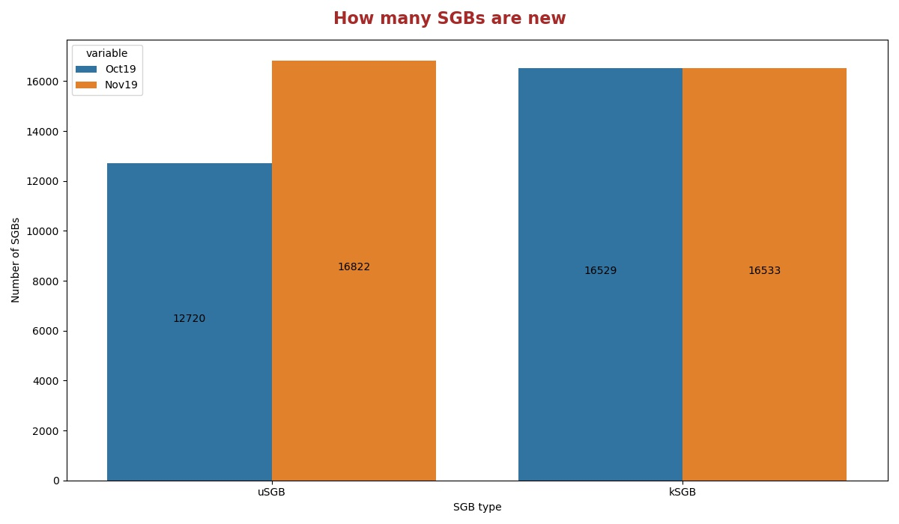
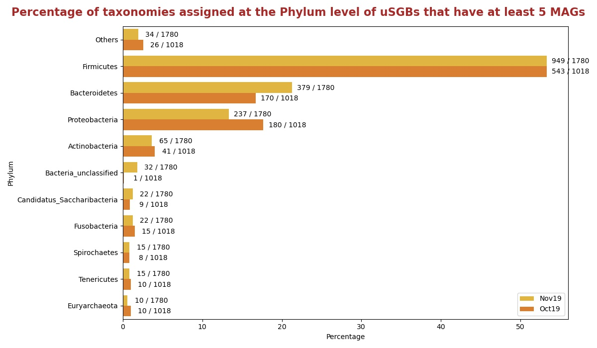
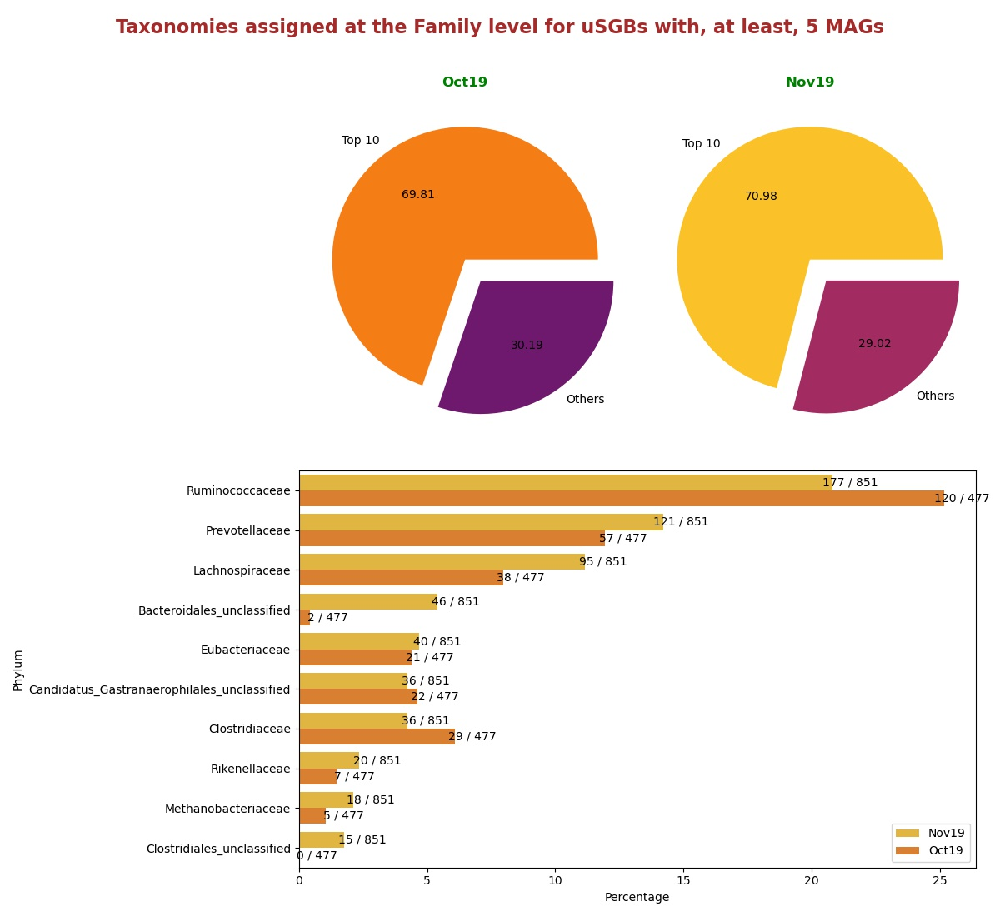
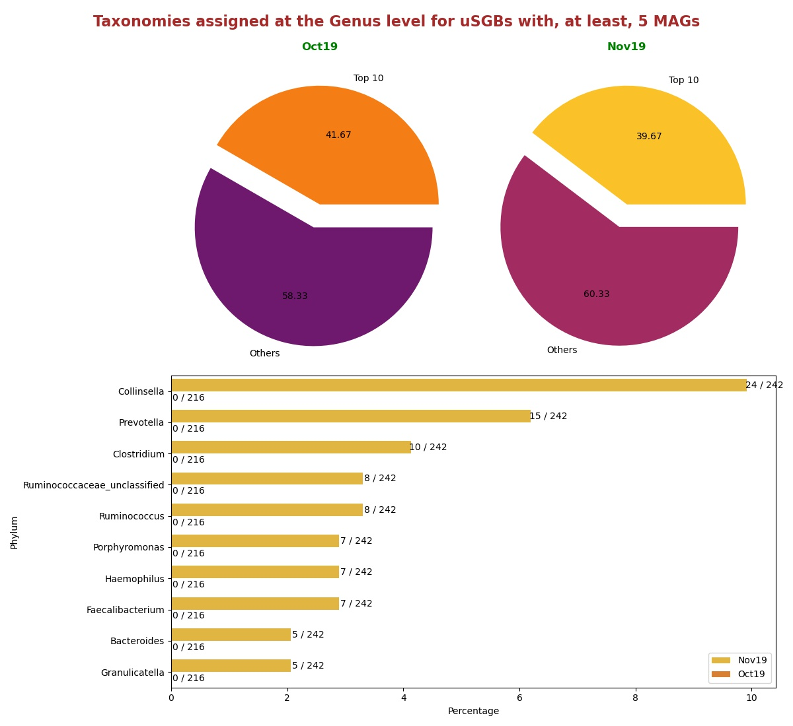

# Comparisons between version Nov19 and Oct19
In this document there are statistics to compare the releases Nov19 and Oct19.

## How many SGBs are new
Histogram showing the number of uSGBs and kSGBs between Nov19 and Oct19.

## How many SGBs change type
Histogram showing the number of kSGBs that change to uSGBs and viceversa from Oct19 and Nov19.

### [Here](pages/df_second_fig2.md) the list of SGBs that change SGB type

### [Here](pages/df_second_fig2_upgrade.md) the list of uSGBs that change to kSGB

### [Here](pages/df_second_fig2_downgrade.md) the list of kSGBs that change to uSGB

<table><tr><th colspan = '4' style = 'text-align: center'>Phylum</th><th colspan = '4' style = 'text-align: center'>Family</th><th colspan = '4' style = 'text-align: center'>Genus</th><th colspan = '4' style = 'text-align: center'>Species</th></tr><tr><th colspan = '2' style = 'text-align: center'>Oct19</th><th colspan = '2' style = 'text-align: center'>Nov19</th><th colspan = '2' style = 'text-align: center'>Oct19</th><th colspan = '2' style = 'text-align: center'>Nov19</th><th colspan = '2' style = 'text-align: center'>Oct19</th><th colspan = '2' style = 'text-align: center'>Nov19</th><th colspan = '2' style = 'text-align: center'>Oct19</th><th colspan = '2' style = 'text-align: center'>Nov19</th></tr><tr><th style = 'text-align: center'>Name</th><th style = 'text-align: center'>Count</th><th style = 'text-align: center'>Name</th><th style = 'text-align: center'>Count</th><th style = 'text-align: center'>Name</th><th style = 'text-align: center'>Count</th><th style = 'text-align: center'>Name</th><th style = 'text-align: center'>Count</th><th style = 'text-align: center'>Name</th><th style = 'text-align: center'>Count</th><th style = 'text-align: center'>Name</th><th style = 'text-align: center'>Count</th><th style = 'text-align: center'>Name</th><th style = 'text-align: center'>Count</th><th style = 'text-align: center'>Name</th><th style = 'text-align: center'>Count</th></tr><tr><td>Firmicutes</td><td>3104</td><td>Firmicutes</td><td>4945</td><td>Ruminococcaceae</td><td>363</td><td>Ruminococcaceae</td><td>492</td><td>Collinsella</td><td>331</td><td>Collinsella</td><td>334</td><td>Rhizobiales bacterium</td><td>81</td><td>Rhizobiales bacterium</td><td>81</td></tr><tr><td>Proteobacteria</td><td>2354</td><td>Proteobacteria</td><td>2634</td><td>Prevotellaceae</td><td>189</td><td>Prevotellaceae</td><td>324</td><td>Streptococcus</td><td>102</td><td>Streptococcus</td><td>102</td><td>Pseudomonas fluorescens</td><td>47</td><td>Pseudomonas fluorescens</td><td>47</td></tr><tr><td>Bacteroidetes</td><td>1303</td><td>Bacteroidetes</td><td>1706</td><td>Lachnospiraceae</td><td>136</td><td>Lachnospiraceae</td><td>243</td><td>Prevotella</td><td>58</td><td>Prevotella</td><td>61</td><td>Streptococcus mitis</td><td>34</td><td>Streptococcus mitis</td><td>34</td></tr><tr><td>Actinobacteria</td><td>706</td><td>Actinobacteria</td><td>852</td><td>Flavobacteriaceae</td><td>113</td><td>Clostridiales unclassified</td><td>138</td><td>Campylobacter</td><td>57</td><td>Campylobacter</td><td>57</td><td>Pseudomonas viridiflava</td><td>30</td><td>Pseudomonas viridiflava</td><td>30</td></tr><tr><td>Euryarchaeota</td><td>149</td><td>Candidatus Saccharibacteria</td><td>240</td><td>Clostridiaceae</td><td>87</td><td>Bacteroidales unclassified</td><td>128</td><td>Haemophilus</td><td>54</td><td>Haemophilus</td><td>54</td><td>Candidatus Hodgkinia cicadicola</td><td>26</td><td>Candidatus Hodgkinia cicadicola</td><td>26</td></tr><tr><td>Candidatus Saccharibacteria</td><td>135</td><td>Tenericutes</td><td>209</td><td>Burkholderiaceae</td><td>72</td><td>Candidatus Gastranaerophilales unclassified</td><td>124</td><td>Faecalibacterium</td><td>39</td><td>Faecalibacterium</td><td>39</td><td>Stenotrophomonas maltophilia</td><td>26</td><td>Stenotrophomonas maltophilia</td><td>26</td></tr><tr><td>Tenericutes</td><td>131</td><td>Fusobacteria</td><td>183</td><td>Eubacteriaceae</td><td>62</td><td>Flavobacteriaceae</td><td>113</td><td>Clostridium</td><td>35</td><td>Ruminococcus</td><td>38</td><td>Prochlorococcus marinus</td><td>21</td><td>Prochlorococcus marinus</td><td>21</td></tr><tr><td>Spirochaetes</td><td>123</td><td>Euryarchaeota</td><td>159</td><td>Candidatus Gastranaerophilales unclassified</td><td>58</td><td>Eubacteriaceae</td><td>101</td><td>Candidatus Saccharibacteria unclassified</td><td>34</td><td>Clostridium</td><td>36</td><td>Pseudomonas putida</td><td>21</td><td>Pseudomonas putida</td><td>21</td></tr><tr><td>Fusobacteria</td><td>115</td><td>Spirochaetes</td><td>157</td><td>Sphingomonadaceae</td><td>56</td><td>Clostridiaceae</td><td>96</td><td>Ruminococcus</td><td>34</td><td>Bacteroides</td><td>34</td><td>Pseudomonas stutzeri</td><td>20</td><td>Pseudomonas stutzeri</td><td>20</td></tr><tr><td>Chloroflexi</td><td>85</td><td>Bacteria unclassified</td><td>116</td><td>Rhodobacteraceae</td><td>52</td><td>Methanobacteriaceae</td><td>77</td><td>Bacteroides</td><td>33</td><td>Candidatus Saccharibacteria unclassified</td><td>34</td><td>Streptococcus oralis</td><td>19</td><td>Streptococcus oralis</td><td>19</td></tr><tr style = 'font-weight: bold'><td>Others</td><td>490</td><td>Others</td><td>564</td><td>Others</td><td>1239</td><td>Others</td><td>1541</td><td>Others</td><td>821</td><td>Others</td><td>891</td><td>Others</td><td>16204</td><td>Others</td><td>16208</td></tr></table>

## Taxonomies assigned at the Phylum level for uSGBs with, at least, 5 MAGs
Percentage of uSGBs with, at least, 5 MAGs assigned to different phylum.

## Taxonomies assigned at the Family level for uSGBs with, at least, 5 MAGs
Percentage of uSGBs with, at least, 5 MAGs assigned to different families. The top 10 assigned families are shown in the histogram in the right.

## Taxonomies assigned at the Genus level for uSGBs with, at least, 5 MAGs
Percentage of uSGBs with, at least, 5 MAGs assigned to different genus. The top 10 assigned genus are shown in the histogram in the right.

