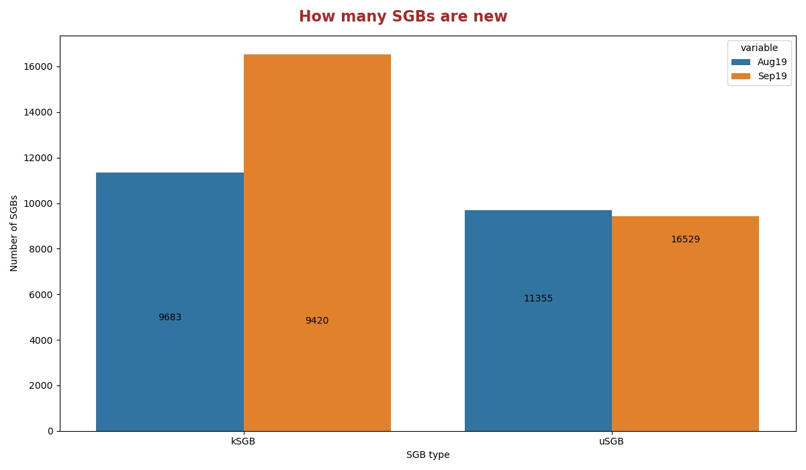
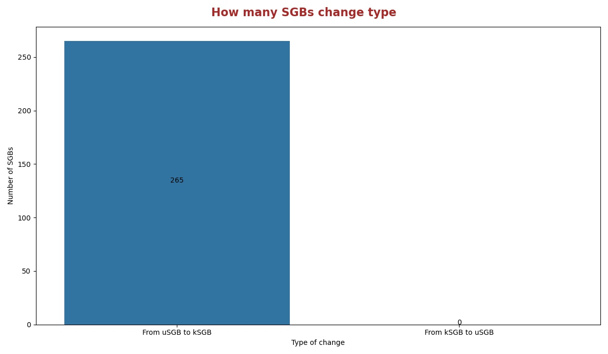
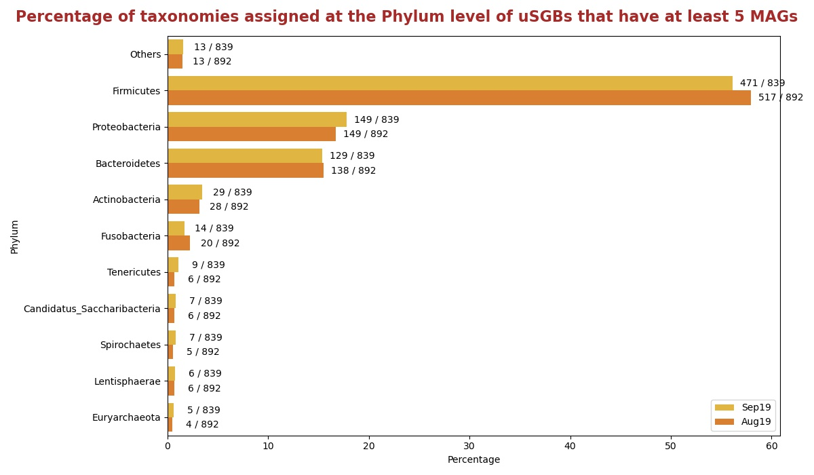
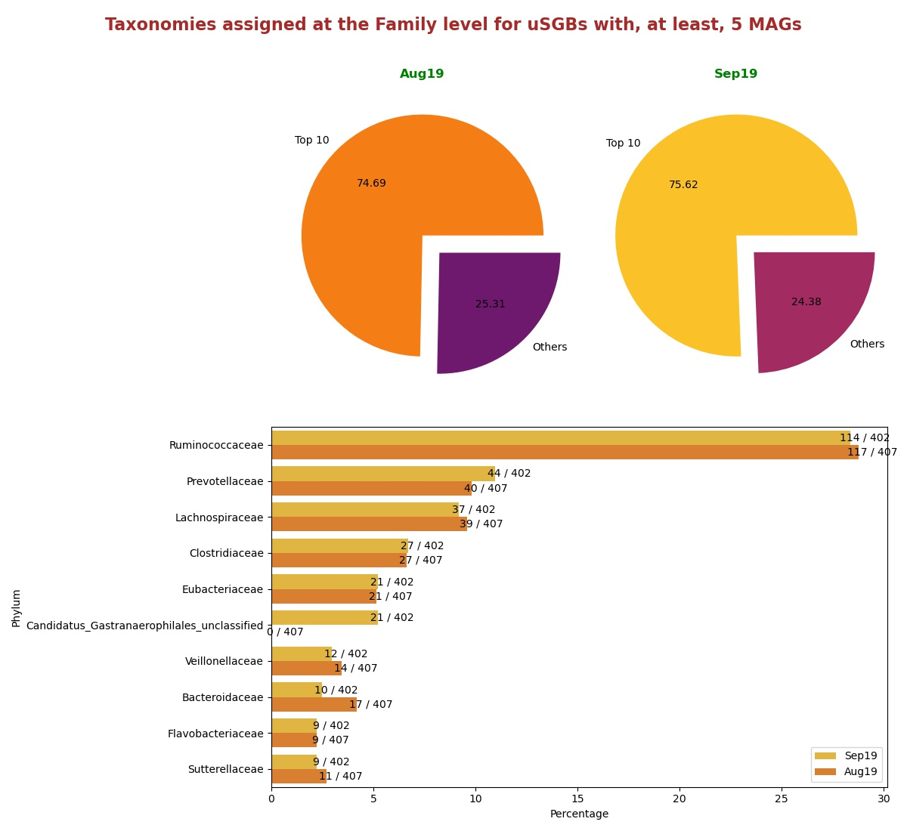
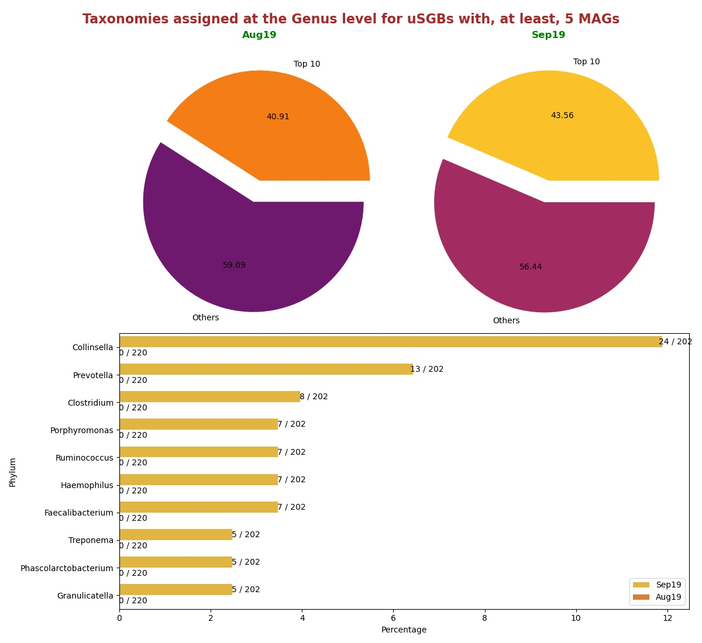

# Comparisons between version Sep19 and Aug19
In this document there are statistics to compare the releases Sep19 and Aug19.

## How many SGBs are new
Histogram showing the number of uSGBs and kSGBs between Sep19 and Aug19.

## How many SGBs change type
Histogram showing the number of kSGBs that change to uSGBs and viceversa from Aug19 and Sep19.

### [Here](pages/df_second_fig2.md) the list of SGBs that change SGB type

### [Here](pages/df_second_fig2_upgrade.md) the list of uSGBs that change to kSGB

### [Here](pages/df_second_fig2_downgrade.md) the list of kSGBs that change to uSGB

<table><tr><th colspan = '4' style = 'text-align: center'>Phylum</th><th colspan = '4' style = 'text-align: center'>Family</th><th colspan = '4' style = 'text-align: center'>Genus</th><th colspan = '4' style = 'text-align: center'>Species</th></tr><tr><th colspan = '2' style = 'text-align: center'>Aug19</th><th colspan = '2' style = 'text-align: center'>Sep19</th><th colspan = '2' style = 'text-align: center'>Aug19</th><th colspan = '2' style = 'text-align: center'>Sep19</th><th colspan = '2' style = 'text-align: center'>Aug19</th><th colspan = '2' style = 'text-align: center'>Sep19</th><th colspan = '2' style = 'text-align: center'>Aug19</th><th colspan = '2' style = 'text-align: center'>Sep19</th></tr><tr><th style = 'text-align: center'>Name</th><th style = 'text-align: center'>Count</th><th style = 'text-align: center'>Name</th><th style = 'text-align: center'>Count</th><th style = 'text-align: center'>Name</th><th style = 'text-align: center'>Count</th><th style = 'text-align: center'>Name</th><th style = 'text-align: center'>Count</th><th style = 'text-align: center'>Name</th><th style = 'text-align: center'>Count</th><th style = 'text-align: center'>Name</th><th style = 'text-align: center'>Count</th><th style = 'text-align: center'>Name</th><th style = 'text-align: center'>Count</th><th style = 'text-align: center'>Name</th><th style = 'text-align: center'>Count</th></tr><tr><td>Firmicutes</td><td>2511</td><td>Firmicutes</td><td>2309</td><td>Ruminococcaceae</td><td>307</td><td>Ruminococcaceae</td><td>305</td><td>Collinsella</td><td>330</td><td>Collinsella</td><td>331</td><td>Pseudomonas fluorescens</td><td>36</td><td>Rhizobiales bacterium</td><td>81</td></tr><tr><td>Proteobacteria</td><td>1650</td><td>Proteobacteria</td><td>1649</td><td>Lachnospiraceae</td><td>132</td><td>Lachnospiraceae</td><td>128</td><td>Streptococcus</td><td>107</td><td>Streptococcus</td><td>102</td><td>Streptococcus mitis</td><td>27</td><td>Pseudomonas fluorescens</td><td>47</td></tr><tr><td>Bacteroidetes</td><td>824</td><td>Bacteroidetes</td><td>814</td><td>Prevotellaceae</td><td>108</td><td>Prevotellaceae</td><td>114</td><td>Campylobacter</td><td>59</td><td>Campylobacter</td><td>57</td><td>Candidatus Hodgkinia cicadicola</td><td>26</td><td>Streptococcus mitis</td><td>34</td></tr><tr><td>Actinobacteria</td><td>490</td><td>Actinobacteria</td><td>491</td><td>Clostridiaceae</td><td>84</td><td>Clostridiaceae</td><td>81</td><td>Prevotella</td><td>59</td><td>Prevotella</td><td>56</td><td>Stenotrophomonas maltophilia</td><td>21</td><td>Pseudomonas viridiflava</td><td>30</td></tr><tr><td>Fusobacteria</td><td>116</td><td>Candidatus Saccharibacteria</td><td>99</td><td>Flavobacteriaceae</td><td>77</td><td>Flavobacteriaceae</td><td>75</td><td>Haemophilus</td><td>55</td><td>Haemophilus</td><td>54</td><td>Pseudomonas stutzeri</td><td>20</td><td>Candidatus Hodgkinia cicadicola</td><td>26</td></tr><tr><td>Euryarchaeota</td><td>88</td><td>Tenericutes</td><td>97</td><td>Candidatus Saccharibacteria unclassified</td><td>64</td><td>Burkholderiaceae</td><td>50</td><td>Faecalibacterium</td><td>39</td><td>Faecalibacterium</td><td>39</td><td>Prochlorococcus marinus</td><td>17</td><td>Stenotrophomonas maltophilia</td><td>26</td></tr><tr><td>Tenericutes</td><td>88</td><td>Fusobacteria</td><td>96</td><td>Burkholderiaceae</td><td>54</td><td>Candidatus Gastranaerophilales unclassified</td><td>48</td><td>Ruminococcus</td><td>34</td><td>Candidatus Saccharibacteria unclassified</td><td>34</td><td>Pseudomonas putida</td><td>17</td><td>Prochlorococcus marinus</td><td>21</td></tr><tr><td>Spirochaetes</td><td>85</td><td>Spirochaetes</td><td>88</td><td>Eubacteriaceae</td><td>46</td><td>Eubacteriaceae</td><td>48</td><td>Clostridium</td><td>31</td><td>Ruminococcus</td><td>34</td><td>Bacillus cereus</td><td>15</td><td>Pseudomonas putida</td><td>21</td></tr><tr><td>Candidatus Saccharibacteria</td><td>61</td><td>Euryarchaeota</td><td>82</td><td>Bacteroidaceae</td><td>41</td><td>Candidatus Saccharibacteria unclassified</td><td>38</td><td>Phascolarctobacterium</td><td>31</td><td>Bacteroides</td><td>33</td><td>Gilliamella apicola</td><td>15</td><td>Pseudomonas stutzeri</td><td>20</td></tr><tr><td>Chloroflexi</td><td>57</td><td>Chloroflexi</td><td>52</td><td>Sphingomonadaceae</td><td>39</td><td>Sphingomonadaceae</td><td>38</td><td>Actinomyces</td><td>30</td><td>Clostridium</td><td>32</td><td>Streptococcus oralis</td><td>15</td><td>Streptococcus oralis</td><td>19</td></tr><tr style = 'font-weight: bold'><td>Others</td><td>281</td><td>Others</td><td>316</td><td>Others</td><td>952</td><td>Others</td><td>899</td><td>Others</td><td>753</td><td>Others</td><td>731</td><td>Others</td><td>11146</td><td>Others</td><td>16204</td></tr></table>

## Taxonomies assigned at the Phylum level for uSGBs with, at least, 5 MAGs
Percentage of uSGBs with, at least, 5 MAGs assigned to different phylum.

## Taxonomies assigned at the Family level for uSGBs with, at least, 5 MAGs
Percentage of uSGBs with, at least, 5 MAGs assigned to different families. The top 10 assigned families are shown in the histogram in the right.

## Taxonomies assigned at the Genus level for uSGBs with, at least, 5 MAGs
Percentage of uSGBs with, at least, 5 MAGs assigned to different genus. The top 10 assigned genus are shown in the histogram in the right.

