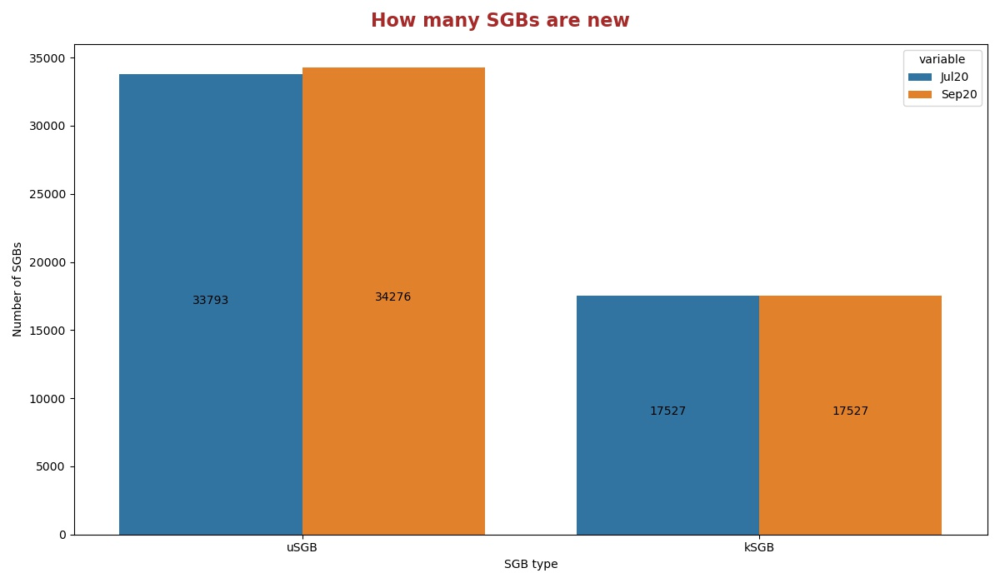
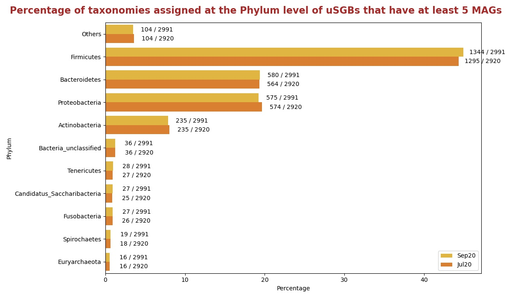
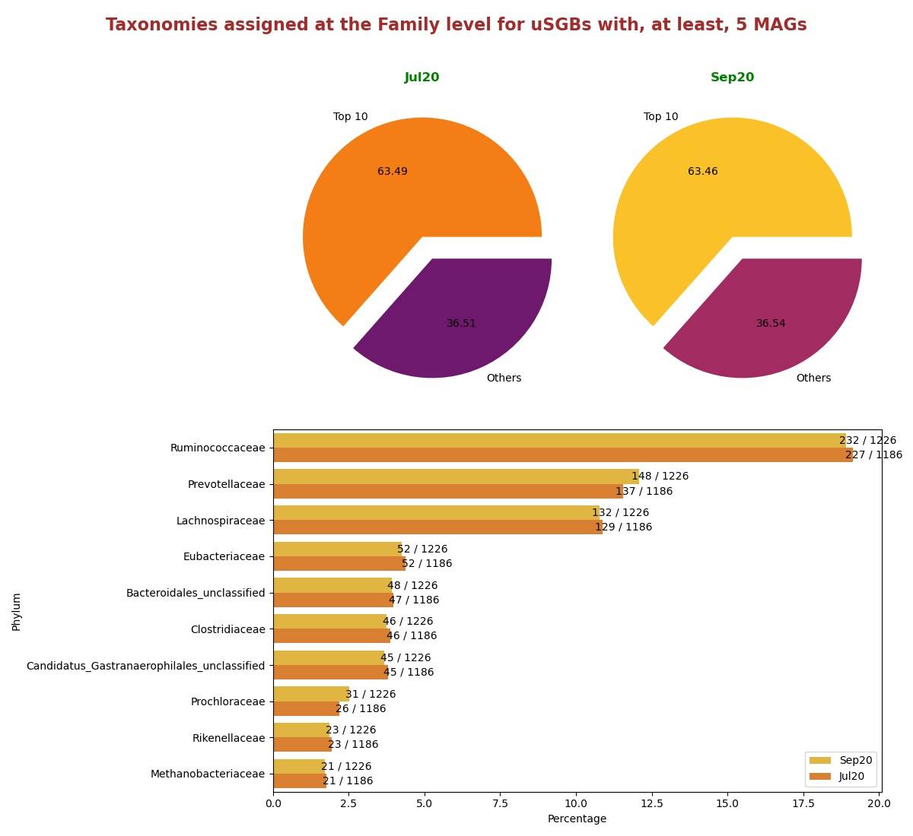
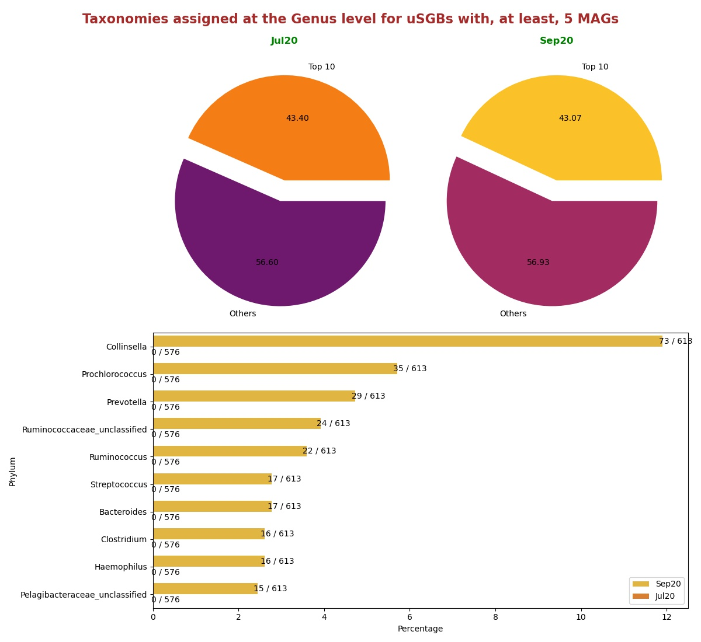

# Comparisons between version [Sep20](README.md) and [Jul20](../Jul20/README.md)
In this document there are statistics to compare the releases Sep20 and Jul20.

## How many SGBs are new
Histogram showing the number of uSGBs and kSGBs between Sep20 and Jul20.

## How many SGBs change type
Histogram showing the number of kSGBs that change to uSGBs and viceversa from Jul20 and Sep20.

### [Here](pages/df_second_fig2.md) the list of SGBs that change SGB type

### [Here](pages/df_second_fig2_upgrade.md) the list of uSGBs that change to kSGB

### [Here](pages/df_second_fig2_downgrade.md) the list of kSGBs that change to uSGB

<table><tr><th colspan = '4' style = 'text-align: center'>Phylum</th><th colspan = '4' style = 'text-align: center'>Family</th><th colspan = '4' style = 'text-align: center'>Genus</th><th colspan = '4' style = 'text-align: center'>Species</th></tr><tr><th colspan = '2' style = 'text-align: center'>Jul20</th><th colspan = '2' style = 'text-align: center'>Sep20</th><th colspan = '2' style = 'text-align: center'>Jul20</th><th colspan = '2' style = 'text-align: center'>Sep20</th><th colspan = '2' style = 'text-align: center'>Jul20</th><th colspan = '2' style = 'text-align: center'>Sep20</th><th colspan = '2' style = 'text-align: center'>Jul20</th><th colspan = '2' style = 'text-align: center'>Sep20</th></tr><tr><th style = 'text-align: center'>Name</th><th style = 'text-align: center'>Count</th><th style = 'text-align: center'>Name</th><th style = 'text-align: center'>Count</th><th style = 'text-align: center'>Name</th><th style = 'text-align: center'>Count</th><th style = 'text-align: center'>Name</th><th style = 'text-align: center'>Count</th><th style = 'text-align: center'>Name</th><th style = 'text-align: center'>Count</th><th style = 'text-align: center'>Name</th><th style = 'text-align: center'>Count</th><th style = 'text-align: center'>Name</th><th style = 'text-align: center'>Count</th><th style = 'text-align: center'>Name</th><th style = 'text-align: center'>Count</th></tr><tr><td>Firmicutes</td><td>7292</td><td>Firmicutes</td><td>7426</td><td>Prochloraceae</td><td>723</td><td>Prochloraceae</td><td>728</td><td>Prochlorococcus</td><td>773</td><td>Prochlorococcus</td><td>773</td><td>Ruminococcaceae bacterium</td><td>179</td><td>Ruminococcaceae bacterium</td><td>179</td></tr><tr><td>Proteobacteria</td><td>7039</td><td>Proteobacteria</td><td>7063</td><td>Ruminococcaceae</td><td>675</td><td>Ruminococcaceae</td><td>688</td><td>Pelagibacteraceae unclassified</td><td>713</td><td>Pelagibacteraceae unclassified</td><td>713</td><td>Rhizobiales bacterium</td><td>91</td><td>Rhizobiales bacterium</td><td>91</td></tr><tr><td>Bacteroidetes</td><td>3236</td><td>Bacteroidetes</td><td>3271</td><td>Prevotellaceae</td><td>322</td><td>Prevotellaceae</td><td>331</td><td>Collinsella</td><td>333</td><td>Collinsella</td><td>333</td><td>Buchnera aphidicola</td><td>49</td><td>Buchnera aphidicola</td><td>49</td></tr><tr><td>Actinobacteria</td><td>2288</td><td>Actinobacteria</td><td>2324</td><td>Lachnospiraceae</td><td>270</td><td>Lachnospiraceae</td><td>273</td><td>Candidatus Pelagibacter</td><td>236</td><td>Candidatus Pelagibacter</td><td>236</td><td>Pseudomonas fluorescens</td><td>47</td><td>Pseudomonas fluorescens</td><td>47</td></tr><tr><td>Euryarchaeota</td><td>379</td><td>Euryarchaeota</td><td>381</td><td>Candidatus Gastranaerophilales unclassified</td><td>127</td><td>Candidatus Gastranaerophilales unclassified</td><td>129</td><td>Streptococcus</td><td>159</td><td>Streptococcus</td><td>163</td><td>Streptococcus mitis</td><td>35</td><td>Streptococcus mitis</td><td>35</td></tr><tr><td>Candidatus Saccharibacteria</td><td>304</td><td>Candidatus Saccharibacteria</td><td>307</td><td>Flavobacteriaceae</td><td>124</td><td>Flavobacteriaceae</td><td>127</td><td>Microbacterium</td><td>109</td><td>Microbacterium</td><td>109</td><td>Fibrobacter succinogenes</td><td>29</td><td>Fibrobacter succinogenes</td><td>29</td></tr><tr><td>Tenericutes</td><td>285</td><td>Tenericutes</td><td>290</td><td>Pelagibacteraceae</td><td>123</td><td>Pelagibacteraceae</td><td>123</td><td>Alphaproteobacteria unclassified</td><td>92</td><td>Ruminococcaceae unclassified</td><td>100</td><td>Pseudomonas viridiflava</td><td>29</td><td>Pseudomonas viridiflava</td><td>29</td></tr><tr><td>Spirochaetes</td><td>246</td><td>Fusobacteria</td><td>252</td><td>Bacteroidales unclassified</td><td>119</td><td>Bacteroidales unclassified</td><td>121</td><td>Ruminococcaceae unclassified</td><td>91</td><td>Alphaproteobacteria unclassified</td><td>92</td><td>Ruminococcus flavefaciens</td><td>28</td><td>Ruminococcus flavefaciens</td><td>28</td></tr><tr><td>Fusobacteria</td><td>245</td><td>Spirochaetes</td><td>250</td><td>Clostridiales unclassified</td><td>119</td><td>Clostridiales unclassified</td><td>119</td><td>Prevotella</td><td>68</td><td>Campylobacter</td><td>80</td><td>Rhodobacteraceae bacterium</td><td>26</td><td>Rhodobacteraceae bacterium</td><td>26</td></tr><tr><td>Chloroflexi</td><td>188</td><td>Chloroflexi</td><td>188</td><td>Clostridiaceae</td><td>106</td><td>Clostridiaceae</td><td>109</td><td>Campylobacter</td><td>63</td><td>Prevotella</td><td>73</td><td>Stenotrophomonas maltophilia</td><td>26</td><td>Stenotrophomonas maltophilia</td><td>26</td></tr><tr style = 'font-weight: bold'><td>Others</td><td>1561</td><td>Others</td><td>1567</td><td>Others</td><td>3050</td><td>Others</td><td>3097</td><td>Others</td><td>2335</td><td>Others</td><td>2440</td><td>Others</td><td>16987</td><td>Others</td><td>16987</td></tr></table>

## Taxonomies assigned at the Phylum level for uSGBs with, at least, 5 MAGs
Percentage of uSGBs with, at least, 5 MAGs assigned to different phylum.

## Taxonomies assigned at the Family level for uSGBs with, at least, 5 MAGs
Percentage of uSGBs with, at least, 5 MAGs assigned to different families. The top 10 assigned families are shown in the histogram in the right.

## Taxonomies assigned at the Genus level for uSGBs with, at least, 5 MAGs
Percentage of uSGBs with, at least, 5 MAGs assigned to different genus. The top 10 assigned genus are shown in the histogram in the right.

